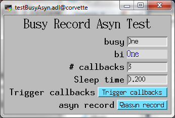

busy Release Notes
==================

Release 1-7-4
-------------

Converted documentation to github pages

Release 1-7-3
-------------

Added bob files, updated edl and ui files.

Release 1-7-2
-------------

Req files installed to top level db folder

Release 1-7-1
-------------

Fixes to build with EPICS v7

Cleaned up Documentation

Release 1-7
-----------

Fix to asyn device support. There were 2 problems:

*   Problem 1
    *   Busy record has a value of 1 autosave file. (It is not sufficient to have 1 in the .db file, because device support reads the value from the driver, and that will be 0.
    *   Driver does an initial callback with value 0 as soon as iocInit completes, i.e. when interruptAccept=1.
    *   Driver gets sent the value 1, but the record has the value 0.
    *   This happens because the callback with value 0 occurs after the driver has queued the request to send 1 but before the value is written to the driver. The 0 to 1 callback which happens later is ignored by device support.
    *   This occurs in devBusyAsyn.c R1-6-1 and earlier.
*   Problem 2
    *   Driver is configured for asynchronous device support (ASYN\_CANBLOCK=1)
    *   Busy record sends a value of 1 to driver.
    *   Driver immediately does a callback with a value of 0.
    *   Busy record is stuck in the 1 state, it ignores the callback value of 0 because PACT=1 when callback occurs.
    *   This problem was introduced in devBusyAsyn.c commit a04e121da0acd71226fbe722fbf1b9551b21fe00 which was an attempt to fix problem 1 above. There was no released version of the busy module with this bug.

A test application to demonstrate these problems was added to the busy module. It allows testing all combinations of the following 6 settings:

1.  Synchronous driver, i.e. ASYN\_CANBLOCK not set.
2.  Asynchronous driver, i.e. ASYN\_CANBLOCK is set.
3.  Driver callback is done in the write() operation.
4.  Driver callback is done in a separate thread. The callbacks are triggered with the TriggerCallbacks record.
5.  Single callback is done in each operation.
6.  Multiple callbacks are done in each operation. The NumCallbacks record selects the number of callbacks.

The callback value is the logical inverse of the current record value. This means that if 1 is written to the record the callback value will be 0, and the record value will immediately change to 0. For the triggered callbacks the values will toggle between 0 and 1. The following is a screen shot of the test application:

The test application requires autosave, so busy is now optionally dependent on autosave.

This release changes the interrupt callback logic. Previously it was directly calling monitor() and recGblFwdLink and not actually processing the record. It was hard to get the logic right, and the 2 previous versions of this support had bugs discussed above. The proper solution is to process the record on each callback.

This version is based directly on the code for the bo record in devAsynInt32.c in asyn R4-33. The bo record was just changed to the busy record, and the logic is the same as that for bo records with the asyn:READBACK info tag. It processes the record on each callback from the driver, and distinguishes between record processing due to driver callbacks (in which case the driver must not be called) and normal record processing (in which case the driver must be called).

This fix also makes the record have correct timestamps when callbacks occur, which was not the case with the previous versions.

Mark Rivers is responsible for these changes.

Release 1-6-1
-------------

Build failed on Windows because comment character not at beginning of line.

Release 1-6
-----------

Fixed a bug when the using asynchronous device support, for example devBusyAsyn with an asyn port driver with ASYN\_CANBLOCK. The problem occurred when 0 was written to the record, followed immediately by writing 1. If the record was still processing with the 0 value when the 1 was written, device support would not process a second time with the 1 value. It should have processed a second time with the 1 value (via the EPICS .RPRO field), but this was not happening.

Release 1-5
-----------

configure/CONFIG no longer defines STATIC\_BUILD=YES on any platform.

Added caQtDM display.

Release 1-4
-----------

Added autosave-request file busyRecord\_settings.req.

RELEASE\* changes

Added .opi display file for CSS-BOY

Release 1-3
-----------

Added busyRecord.db database, xxBusyRecord.adl medm-display file.

busyRecord.c rewritten to minimize differences from 3.14.11 bo record.

Release 1-2
-----------

Ben Franksen's "Raw Soft Channel" device support allows the busy record to write a user configurable integer value (the value of the MASK field) via its OUT link, when the record's VAL field has the value 1. Currently, MASK can only be specified at DCT time. For example, you can configure MASK to a bit-pattern and have the BUSY record write this value to a selRecord's SELN field.

Release 1-1
-----------

The busy record was reimplemented to permit device support to reset the VAL field to zero.

This version is intended to build with EPICS base 3.14.10.

Release 1-0
-----------

This is the first release of the synApps busy module.

This version is intended to build with EPICS base 3.14.10.

Suggestions and Comments to:  
[Tim Mooney](mailto:mooney@aps.anl.gov) : (mooney@aps.anl.gov)  
Last modified: Nov 14, 2017
